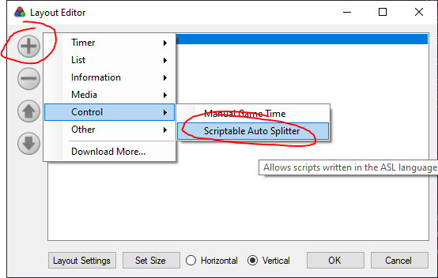
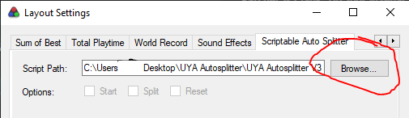
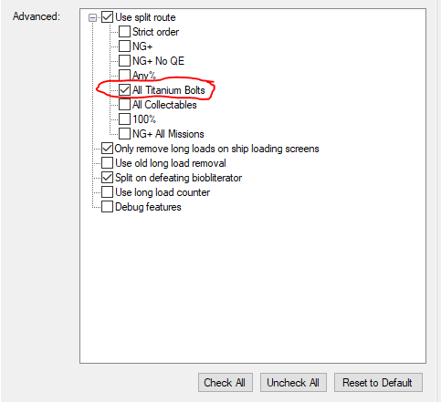
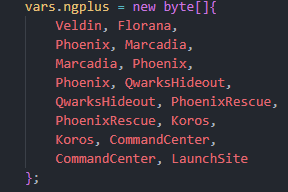

# rac3-autosplitter

Autosplitter for Ratchet & Clank 3. Automatically start, split, reset, and time out long loads. For use with [LiveSplit](https://github.com/LiveSplit/LiveSplit).

## Features
* Automatic long load counting and removal
* Biobliterator split
* Built-in split routes for all 6 categories, plus ability to make your own
* Blank splits for all 6 categories
* Does not require any modification to racman

## TL;DR setup guide

You need [racman](https://github.com/MichaelRelaxen/racman).

1. Download the file named ["rac3-autosplitter.asl"](https://github.com/king-dedede1/rac3-autosplitter/raw/main/rac3-autosplitter.asl) (Right click the link and select "Save link as...", or open the link and press CTRL+S)

2. Edit your layout and add a new Scriptable Autosplitter

3. Double click the autosplitter to access the settings. Next to "Script Path" click on "Browse..." and select the ASL file you downloaded

4. Check the category you want to run.

5. Setup your splits. You can use the blank splits that are included or use ones you already have. If you want to add, remove, or change splits, you can edit the split route in the ASL file. (see [Split routes](#split-routes)) **Make sure that the splits start timing at -1 second.**

6. Switch livesplit comparison to "game time".

7. You're done!

## Long load removal

Long load removal is enabled by default; all you need to do is switch your comparison to game time. If you want to see real time and game time at the same time, either add two timers or use [this thing](https://github.com/Dalet/LiveSplit.AlternateTimingMethod). I personally use that thing.

## Long load counting

If for whatever reason you want to know exactly how many long loads there are in your run, the autosplitter counts them for you. All you have to do is add a text component to your layout. **Make sure the left text is set to "Long Loads" or it won't work.** Then, enable "Use long load counter" in the settings.

## Split routes

In the rac1 autosplitter that is bundled in racman, it just splits whever the current level changes. This works great in that game, but in UYA this solution isn't as practical because there's a lot more level transitions and you probably won't want to split on all of them. For example, if you're splitting on leaving a vid-comic, it doesn't make sense to split on entering a vid-comic as well.

The solution here is split routes, which are a list of planets and destinations that will be split on. You specify where you want to split and in what order so that the autosplitter doesn't split when you don't want it to.

The autosplitter comes bundled with a few split routes, one for every category on the main boards. However, some people may have different preferences on where they want to split. For example, in ATB some people split on the first phoenix visit while others wait until marcadia. In these cases it may be nescessary to edit the split path. This can be done by editing the ASL file.

Just go down to line 110:

Here is a list of planets seperated by commas. On the left side is the current planet and on the right side is the destination planet. In this example, the first line says "Split when traveling to florana from veldin." Be sure that the names aren't misspelled and that there's a comma after every entry (except the last one).

### Strict Order Mode

By default the split routes don't check the order that the splits are completed in. In the above example, if you go from marcadia to phoenix before going from veldin to florana, it'll still split. By turning on strict order mode you can ensure that the splits are actually completed in order. This can prevent it from splitting when you don't want to when in cases when you visit a planet more than once. However, if you accidentally go to the wrong planet, it can get break sometimes, which is why this is off by default.

## Settings in-depth

### Use split route

**Enabled by default.** Toggles the use of a split route. If it is off the autosplitter splits on every level transition.

### Only remove long loads on ship loading screens

**Enabled by default.** If this is on, long loads will only be counted and removed on loading screens with a ship. For example, aquatos sewers and launch site will not count long loads. It's unclear whether the rules call for removing loads in these cases, which is why this it toggleable.

### Use old long load removal

If enabled, long load removal will pause the game timer for about 1 second. If disabled, long load removal will remove one second from the game timer.

### Split on defeating biobliterator

**Enabled by default.** Splits when the Biobliterator's health reaches 0. This should the be the last split in your run. Does not require any modification to the split route.

### Use long load counter

See [Long load counting](#long-load-counting).

### Debug features

Enables some debugging features.
